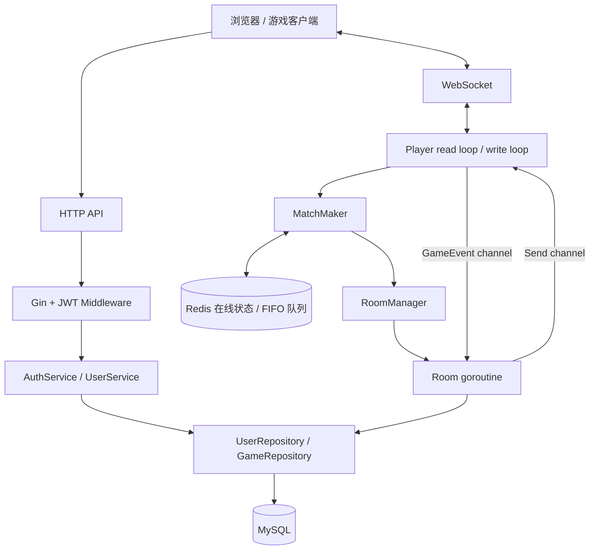
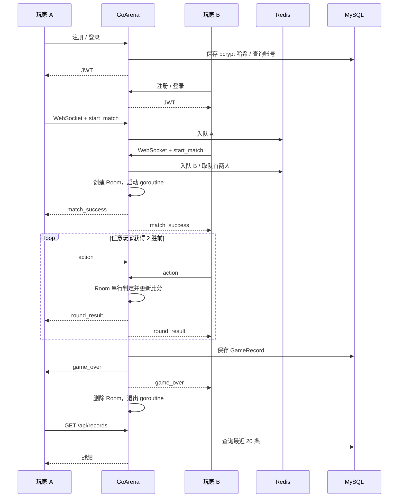

# GoArena — 基于 Go 的轻量级实时多人游戏后台系统

[](https://github.com/ziwenx1973/GoArena/actions/workflows/ci.yml)

GoArena 是基于 Go 实现的轻量级实时多人游戏后台 Demo。两名玩家通过 WebSocket 匹配，进行石头剪刀布对战，先取得两个胜场的一方获胜，最终战绩保存到 MySQL。

项目面向游戏后台开发学习与个人实习作品展示，重点是完整业务流程、连接生命周期与并发状态管理。它是**单进程服务**：房间保存在内存，Redis 负责在线状态和 FIFO 匹配队列，不支持多实例匹配或重启恢复房间。

已在 [GitHub Actions](https://github.com/ziwenx1973/GoArena/actions/runs/35686292637) 使用真实 MySQL 8.4、Redis 7.4 通过端到端测试，同时通过 Linux race 检查。开发机尚未验证 Docker Compose 启动，详见 [验证记录](docs/VALIDATION.md)。

> 仓库地址使用已经创建的 `ziwenx1973/GoArena`；应用名和 Compose 服务名为 `go-arena`。没有为改名创建另一份仓库。

## 核心功能

- 注册、登录、bcrypt 密码哈希、JWT 身份验证与个人信息查询。
- WebSocket read/write loop、心跳、同账号重复连接拒绝、断线清理。
- Redis List FIFO 匹配、取消匹配、重复入队检查、在线状态 TTL。
- Room-per-Goroutine：channel 传递事件，单 goroutine 更新房间状态。
- 出拳校验、隐藏未结算出拳、平局重赛、两胜结束、超时与断线处理。
- GORM 保存最终战绩，查询当前用户最近 20 条记录。
- 原生 HTML/CSS/JavaScript 调试页面。
- Dockerfile、包含 MySQL/Redis 的 Compose 配置，Go 原生测试和 GitHub Actions CI。

## 技术栈

| 分类 | 技术与职责 |
| --- | --- |
| 语言 | Go 1.26+ |
| HTTP | Gin：路由、JSON、JWT middleware |
| 长连接 | gorilla/websocket：双循环与心跳 |
| 身份验证 | golang-jwt/jwt/v5、bcrypt |
| 持久化 | GORM、MySQL 8.x |
| 在线与匹配 | go-redis/v9、Redis 7.x |
| 并发 | goroutine、channel、sync.Mutex/RWMutex |
| 工程 | testing、slog、Docker Compose、GitHub Actions |

具体依赖锁定在 `go.mod` / `go.sum`，未引入微服务、消息队列或第三方 Actor 框架。

## 架构



## 游戏流程



## Room 并发模型

每个房间最多两个玩家，创建后启动一个 `Room.Run()` goroutine。Player 将出拳转换为 `GameEvent`，通过有界 channel 交给房间，不直接修改比分、当前回合和已提交的出拳。Room 使用 `for/select` 串行处理事件、玩家断线、回合超时与服务器关闭。

房间内部的比分和出拳无需加锁。RoomManager 的房间表由 RWMutex 保护；Player 的房间指针有独立的锁；MatchMaker 的在线玩家表、入队标记以及 Redis 队列操作由单进程 Mutex 串行保护。这是本地互斥，不是分布式锁。

每个连接只由 write loop 写业务消息；read loop 读取消息。其他 goroutine 通过 `Send` 投递。发送队列满时关闭慢客户端，避免房间等待它。多生产者的 `Send` 不关闭；`Done` 由 `sync.Once` 关闭，停止两个连接循环，避免 send-on-closed-channel。房间事件队列同样不关闭，以 `Done` 标记结束。

### 规则与异常约定

- 平局不增加胜场，因此总回合数可能超过三回合。
- 双方出拳后才广播选择，未结算时不公开对方出拳。
- 同回合重复出拳被拒绝。可选的 `round` 字段用于拒绝迟到的旧回合消息；调试页始终携带它。省略时按服务器当前回合处理。
- 每回合 60 秒：只有一方出拳则另一方超时判负；双方都未出拳则无胜者结束。
- 游戏中断线判对方获胜，保留当时比分，不补成 2 分。`reason` 用于区分正常结束和判负。
- 关闭服务时结束活动房间，以 `server_shutdown` 保存，无胜者。服务关闭 HTTP、房间、WebSocket 后再关闭 MySQL 和 Redis。
- 保存失败仍结束房间，广播 `error` 和 `record_saved: false`，不会伪报战绩已保存；没有持久化重试队列。
- 同账号只允许一个在线连接。断线后重新连接可重新匹配，不支持回到原房间。
- JWT 有效期 24 小时，在 HTTP 请求和 WebSocket 握手时校验；已建立的连接不会因 JWT 到期自动断开。

## 项目目录

```text
GoArena/
├── cmd/server/main.go
├── internal/
│   ├── config/config.go
│   ├── database/{mysql,redis}.go
│   ├── handler/{auth_handler,user_handler,game_handler}.go
│   ├── middleware/jwt.go
│   ├── model/{user,game_record}.go
│   ├── repository/{user_repository,game_repository}.go
│   ├── service/{auth_service,user_service}.go
│   ├── game/
│   │   ├── player.go
│   │   ├── message.go
│   │   ├── rule.go
│   │   ├── room.go
│   │   ├── room_manager.go
│   │   └── matchmaker.go
│   └── router/router.go
├── web/index.html
├── tests/{auth,rule,room,integration}_test.go
├── scripts/{init.sql,run.ps1}
├── docs/VALIDATION.md
├── .github/workflows/ci.yml
├── .dockerignore
├── .env.example
├── .gitignore
├── Dockerfile
├── docker-compose.yml
├── go.mod
├── go.sum
├── LICENSE
└── README.md
```

只使用环境变量配置，没有多余的 `configs/config.yaml`，避免出现两套配置来源。

## 快速启动

### 方式一：本地 Go + MySQL + Redis

准备 Go 1.26+、MySQL 8.x、Redis 7.x。Windows 可将 Redis 运行在 WSL 或另外一台开发机器上；当前开发不依赖 Docker Desktop。

1. 创建数据库和应用账号。以下 SQL 中密码为占位符，请替换为自己的本地密码：

```sql
CREATE DATABASE go_arena CHARACTER SET utf8mb4 COLLATE utf8mb4_unicode_ci;
CREATE USER 'arena'@'localhost' IDENTIFIED BY 'replace-with-your-local-password';
GRANT ALL PRIVILEGES ON go_arena.* TO 'arena'@'localhost';
```

应用启动时通过 AutoMigrate 建表；`scripts/init.sql` 提供等价的参考结构，不必重复执行。应用账号需要该数据库的建表权限。若数据库在另一台机器，按实际连接来源配置账号 Host。

2. 在项目根目录复制 `.env.example` 为 `.env`，填写 MySQL、Redis 参数和 JWT secret。`JWT_SECRET` 至少 32 字节，可用 `openssl rand -hex 32` 生成。示例中的密码/secret 都只是占位符。

3. Windows PowerShell：

```powershell
Copy-Item .env.example .env # 仅首次执行；随后编辑 .env
go mod download
./scripts/run.ps1
```

Linux / macOS（示例值是简单 KEY=value，不要写 shell 表达式）：

```bash
cp .env.example .env # 仅首次执行；随后编辑 .env
set -a
. ./.env
set +a
go mod download
go run ./cmd/server
```

`config.go` 读取进程环境变量，不自动解析 `.env`；PowerShell 启动脚本会加载它。也可以手动设置环境变量后运行 Go。需从项目根目录启动，以便找到 `web/index.html`。

4. 打开 [本地调试页](http://localhost:8080)，在两个独立标签页分别注册、登录 alice 和 bob，再连接 WebSocket、开始匹配、出拳。JWT 存储在各标签页的 sessionStorage，日志不会显示 token。

5. 完成比赛后点击“查询最近 20 条战绩”。Ctrl+C 停止服务。

### 方式二：Docker Compose

安装 Docker Desktop 或 Docker Engine + Compose 插件。首次复制并编辑 `.env`，填写 `MYSQL_PASSWORD`、`MYSQL_ROOT_PASSWORD`、`JWT_SECRET`，然后执行：

```bash
docker compose config --quiet
docker compose up --build
```

访问 [本地调试页](http://localhost:8080)。应用通过 `mysql:3306` 和 `redis:6379` 连接服务；数据库端口不暴露到宿主机。Compose 会等待数据库健康检查成功后启动应用，MySQL 数据保存在 `mysql-data` volume。

```bash
docker compose down # 保留数据库 volume
```

不要随意使用 `down -v`，它会删除数据库数据。修改 `.env` 中密码不会自动修改已经初始化过的 MySQL volume 中的账号密码。Compose 内部 Redis 无密码，仅位于内部网络；本地运行可通过 `REDIS_PASSWORD` 连接需要密码的 Redis。

**开发机未安装 Docker，未在开发机执行 Compose 容器启动；不要将配置交付等同于容器部署验证。** 详细验证记录见 [docs/VALIDATION.md](docs/VALIDATION.md)。

### 配置项

| 环境变量 | 默认值 / 说明 |
| --- | --- |
| SERVER_PORT | 8080 |
| MYSQL_HOST / MYSQL_PORT | 127.0.0.1 / 3306 |
| MYSQL_USER | arena |
| MYSQL_PASSWORD | 无默认密码 |
| MYSQL_DATABASE | go_arena |
| MYSQL_ROOT_PASSWORD | 仅 Compose 初始化 MySQL 使用 |
| REDIS_HOST / REDIS_PORT | 127.0.0.1 / 6379 |
| REDIS_PASSWORD | 默认空 |
| JWT_SECRET | 必填，至少 32 字节 |

## HTTP API

普通错误统一为 `{"error":"说明"}`。受保护的接口使用 `Authorization: Bearer <token>`。

| 方法与路径 | 认证 | 请求 / 响应 |
| --- | --- | --- |
| POST `/api/register` | 否 | `{ "username":"alice", "password":"123456" }` → 201 用户信息 |
| POST `/api/login` | 否 | 同上 → 200 `{ "token":"..." }` |
| GET `/api/profile` | JWT | 200 `{ "id":1,"username":"alice","created_at":"...","updated_at":"..." }` |
| GET `/api/records` | JWT | 200 `{ "records":[...] }`，最多 20 条 |
| GET `/ws?token=<JWT>` | JWT | 101 WebSocket 升级；无效 token 返回 401 |
| GET `/healthz` | 否 | 200 `{ "status":"ok" }`，仅表示 HTTP 存活 |

用户名限制为 3–32 个 ASCII 字母、数字或下划线，密码 6–72 字节。重复用户名返回 409；输入错误 400；用户不存在或密码错误统一返回 401；数据库错误返回 500，不暴露数据库内部细节。密码哈希不会返回给客户端。

战绩按 `created_at DESC, id DESC` 排序，查询条件限制为当前用户参与的比赛，空记录返回 `[]`。

```bash
curl -X POST http://localhost:8080/api/register \
  -H 'Content-Type: application/json' \
  -d '{"username":"alice","password":"123456"}'
curl -X POST http://localhost:8080/api/login \
  -H 'Content-Type: application/json' \
  -d '{"username":"alice","password":"123456"}'
curl http://localhost:8080/api/records -H 'Authorization: Bearer <token>'
```

示例密码仅用于本地演示。查询参数中携带 JWT 是浏览器 WebSocket API 的接入方式；服务端不记录请求 URL，同源校验拒绝不匹配的浏览器 Origin。若部署到公网，应使用 HTTPS/WSS，并配置代理避免记录 token URL；本项目没有登录限流或生产级账号防护。

## WebSocket 协议

统一格式：`{"type":"xxx","data":{}}`。

| 方向 | type | data / 含义 |
| --- | --- | --- |
| 客户端 → 服务端 | `ping` | `{}`，业务心跳 |
| 客户端 → 服务端 | `start_match` | `{}`，进入 FIFO 队列 |
| 客户端 → 服务端 | `cancel_match` | `{}`，取消等待 |
| 客户端 → 服务端 | `action` | `{"choice":"rock","round":1}`，round 可省略 |
| 服务端 → 客户端 | `pong` | `{}` |
| 服务端 → 客户端 | `match_waiting` | `{}` |
| 服务端 → 客户端 | `match_cancelled` | `{}` |
| 服务端 → 客户端 | `match_success` | `room_id, player1_id, player2_id, round` |
| 服务端 → 客户端 | `round_result` | `room_id, round, player1_choice, player2_choice, winner_id, player1_score, player2_score` |
| 服务端 → 客户端 | `game_over` | `room_id, winner_id, player1_score, player2_score, reason, record_saved` |
| 服务端 → 客户端 | `error` | `{"message":"错误原因"}` |

`choice` 仅支持 `rock`、`paper`、`scissors`。`winner_id: null` 表示平局或无胜者。`reason` 为 `completed`、`disconnect`、`round_timeout` 或 `server_shutdown`。

```json
{"type":"match_success","data":{"room_id":"...","player1_id":1,"player2_id":2,"round":1}}
```

```json
{"type":"round_result","data":{"room_id":"...","round":1,"player1_choice":"rock","player2_choice":"scissors","winner_id":1,"player1_score":1,"player2_score":0}}
```

```json
{"type":"game_over","data":{"room_id":"...","winner_id":1,"player1_score":2,"player2_score":0,"reason":"completed","record_saved":true}}
```

另有 WebSocket 协议层 ping/pong：服务端每 25 秒发送 ping，读超时为 60 秒，浏览器自动回应 pong。业务 `ping` 不代替协议层 pong。消息最大 4 KiB，写超时 5 秒。

## 数据库设计

| 表 | 字段 |
| --- | --- |
| users | id、username（唯一）、password_hash、created_at、updated_at |
| game_records | id、room_id（唯一）、player1_id、player2_id、winner_id（可空）、player1_score、player2_score、reason、created_at |

用户 ID 和时间字段有索引。`room_id` 关联日志与战绩，`reason` 区分完整比赛与提前结束。采用 GORM AutoMigrate，不实现用户删除流程；当前未配置外键约束。

## Redis Key 设计

| Key | 类型 | 生命周期 |
| --- | --- | --- |
| `online:user:<id>` | String，用户名 | 建立连接写入，90 秒 TTL，每 30 秒刷新，断线删除 |
| `match:queue` | List，用户 ID | RPUSH 入队，读取队首两人后 LTRIM 移除；取消用 LREM |

MatchMaker 每 200ms 检查队列。已断开的玩家、无效条目会被清理。Redis 请求设置超时，普通故障记录日志并给发起操作的客户端错误提示，不 panic。

**只允许一个 GoArena 进程独占这些 Key。** 启动时清空旧匹配队列；异常退出留下的在线 Key 等待 TTL 到期。若 Redis 重启丢失队列，等待中的玩家应取消后重新匹配或重新连接，不提供自动恢复保证。

## 测试与 CI

```bash
go mod tidy
gofmt -w cmd internal tests
go vet ./...
go test ./...
go build ./cmd/server
go test -race ./...
```

普通测试不依赖数据库：九种出拳组合、非法 choice、JWT 验证、平局后两胜、重复/过期出拳、断线、保存失败、关闭清理、慢客户端。房间测试使用内存 RecordStore 替身，不能据此宣称 MySQL 已验证。

端到端测试位于 `tests/integration_test.go`，默认显式 SKIP。配置**专用测试数据库和 Redis 实例**，设置环境变量后执行：

```powershell
$env:ARENA_INTEGRATION='1'
go test ./tests -run '^TestIntegration$' -v -count=1
```

Linux / macOS：`ARENA_INTEGRATION=1 go test ./tests -run '^TestIntegration$' -v -count=1`。

它使用真实 MySQL、真实 Redis、HTTP 测试服务器和两个真实 WebSocket 客户端，验证注册 → 登录 → 匹配 → 平局 → 两胜 → 战绩查询，以及取消/重复匹配、非法出拳、再次匹配与断线判负。只删除它创建的测试账号与记录，但会清空专用 Redis 的匹配队列，不要指向运行中的演示环境。

GitHub Actions 在 push / pull_request 时执行依赖下载、格式检查、vet、race 单元测试、build；并启动 MySQL/Redis service containers 运行真实端到端测试。工作流中的密码仅用于临时 CI MySQL，与本地或部署环境无关。CI 不执行部署，也不等同于应用 Dockerfile/Compose 已验证。

## 项目亮点与边界

- 完整连接 HTTP 认证、WebSocket 消息、Redis 匹配、内存房间与数据库战绩，接口和调试页共用同一套真实业务代码。
- 用 Room-per-Goroutine 和 channel 明确状态所有权，只在跨房间共享数据上使用锁。
- 处理连接退出、慢客户端、回合期限、重复操作和保存失败，提供可观察的结果与日志。
- 提供可复现的启动配置、协议文档、单元测试和可选择运行的真实依赖集成测试。

没有进行用户规模、QPS、响应时间、压测或生产可用性测试，不声称任何性能指标。本项目不包含断线重连恢复、持久化房间、分布式匹配、生产认证防护或自动故障转移。

## 演示截图 / GIF 建议

1. 两个标签页分别登录不同账号，展示连接、等待和自动匹配。
2. 录制一次平局、两次获胜，展示实时回合结果与最终比分。
3. 展示 `/api/records` 与数据库同一条战绩（隐藏连接信息）。
4. 展示重复出拳拒绝、取消匹配或游戏中断线判负。
5. 在真实 CI 完成后截取 Actions 通过页面；Docker 截图只在实际运行成功后添加。

录制时不要展示密码、JWT、`.env` 或 Git 凭据。仓库不放未实际运行的演示图。

## 简历描述参考

**GoArena｜基于 Go 的实时多人游戏后台系统**

- 使用 Go、Gin、JWT 与 MySQL 实现注册登录、身份认证和战绩查询，通过 bcrypt 保存密码哈希，完成从用户接入到战绩持久化的业务链路。
- 基于 WebSocket 实现双人实时对战，拆分读写循环并通过发送队列广播结果，处理心跳、断线、重复出拳与慢客户端连接清理。
- 采用 Room-per-Goroutine 模型，通过 Channel 传递玩家事件，由房间独立协程串行处理回合与比分，减少共享游戏状态的锁竞争。
- 使用 Redis 实现 FIFO 匹配与在线状态管理，提供 Dockerfile、Docker Compose 配置，并编写 Go 原生测试及 GitHub Actions CI。
